# 🦉 openFinance (v3.1.0) — Your Money. Your Rules. 💸

A standalone personal finance powerhouse built for developers, privacy purists, and builders who want **absolute control** over their financial destiny. No cloud trackers, no data brokers sniffing your transaction history, and no subscription fees. Just gorgeous Obsidian dashboards, local SQLCipher database encryption, AES-256-GCM local document vault storage, and secure offline AI chat running 100% locally on your machine.

openFinance runs as a native macOS desktop application wrapped in Tauri, combining a React frontend, a Node.js Hono backend sidecar, and SQLCipher. 🚀

---

## ⚡ Desktop Superpowers

- 🛡️ **Passcode-locked local SQLCipher Vault** — Your database is fully encrypted on disk. If the passcode is incorrect, the vault remains completely locked.
- 🔒 **AES-256-GCM Document & Chat Encryption** — Uploaded bank statements, contract notes, and AI conversation histories are encrypted dynamically on write and decrypted on the fly in memory.
- 💻 **Zero-Dependency Native Runtime** — Pre-packaged with embedded Node.js runtimes for both Apple Silicon and Intel macOS architectures. The app runs natively on any Mac out of the box with no Node.js or system environment dependencies.
- 💸 **Envelope Budgeting** — Dynamic zero-based budgeting with custom rollovers (carry it forward, cap it, or reset it).
- 🏦 **Unified Balance Sheet** — Scannable tracking across Checking, Savings, Credit Cards, Cash, Investments, and Loans.
- 📈 **Tax-Loss & Portfolio Tracking** — Real-time performance metrics across mutual funds, stocks, bonds, high-yield deposits, real estate, and crypto.
- 🧠 **100% Offline Local AI Chat** — Talk to your database! Ask natural-language questions like *"How much did I spend on Starbucks this month?"* powered by a local Ollama model. Your data never leaves your machine.
- 💱 **Global Multi-Currency Engine** — Native support for INR, USD, SGD, GBP, EUR, JPY, and NTD with dynamic exchange rates and localized formatting.
- 🌿 **Tactile Obsidian Theme** — A stunning, tactile user experience with rich layered depth, sage-green dark mode undertones, elegant brand gradients, and fluid transitions.
- 📦 **One-Click Backup & Import** — Decrypts files on export to a standard `.zip` folder and re-encrypts with your key when importing.

---

## Screenshots

### 1. Dashboard
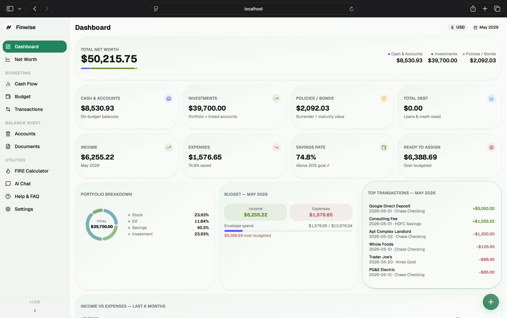

### 2. Net Worth Analytics
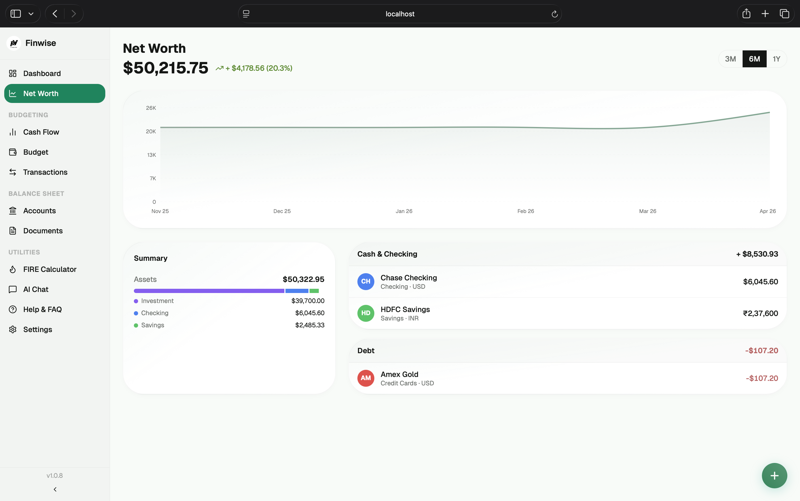

### 3. Cash Flow Visualizer
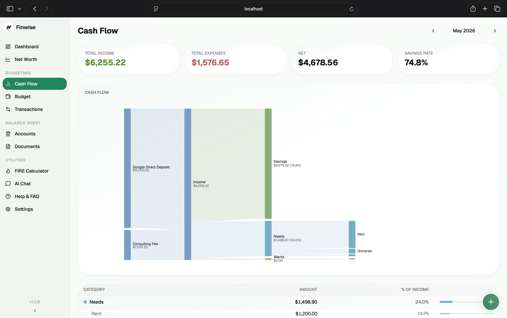

### 4. Envelope Budgeting
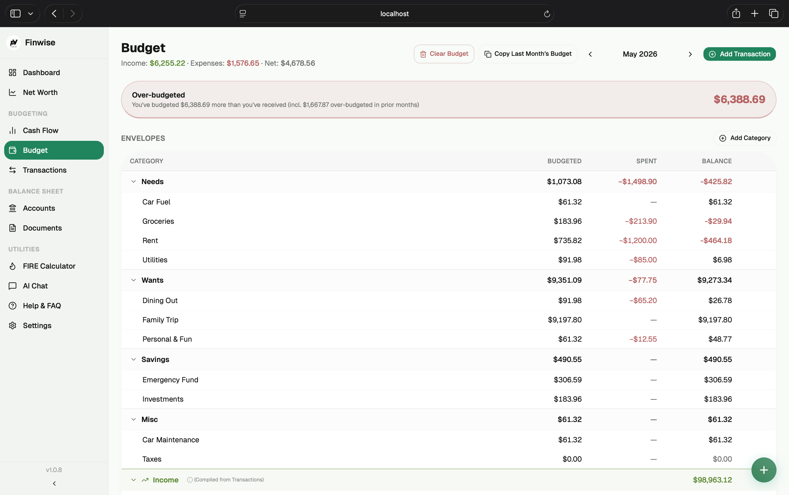

### 5. Transactions Ledger
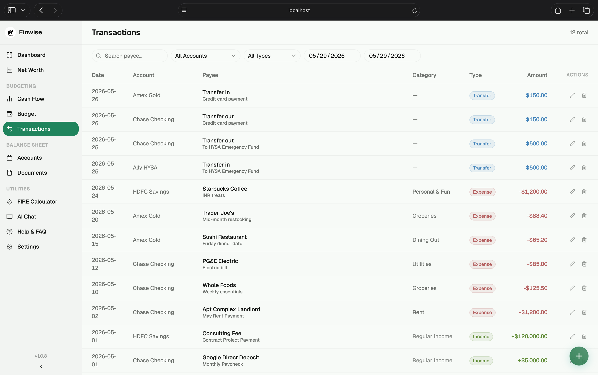

### 6. Checking & Savings Accounts
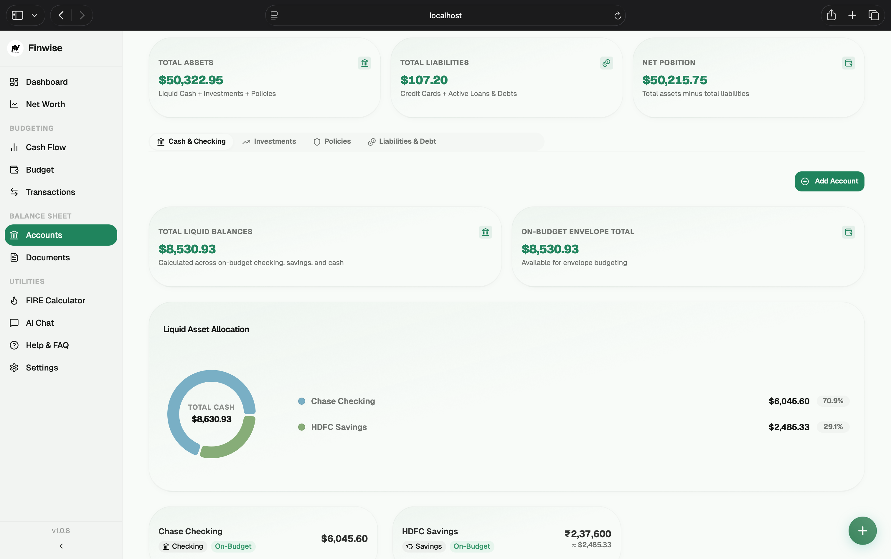

### 7. Investments & Holdings
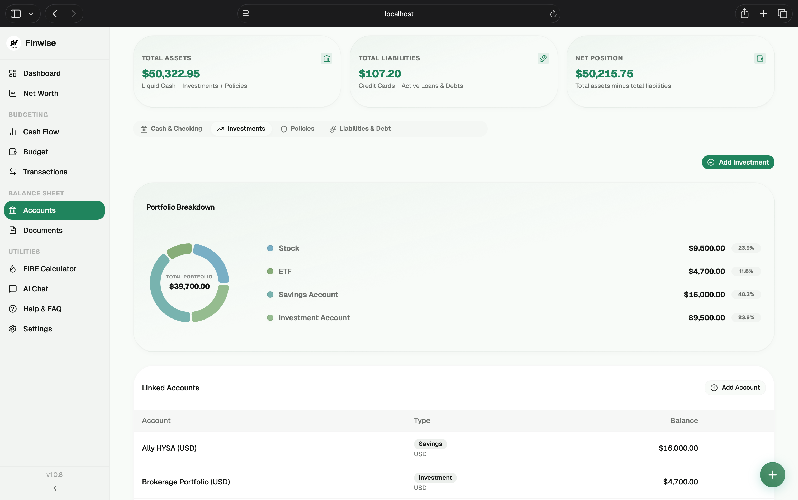

### 8. Insurance Policies
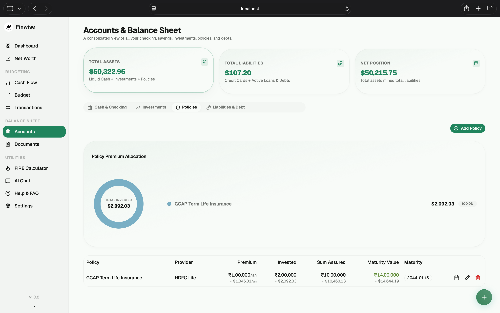

### 9. Debt & Loans Tracker
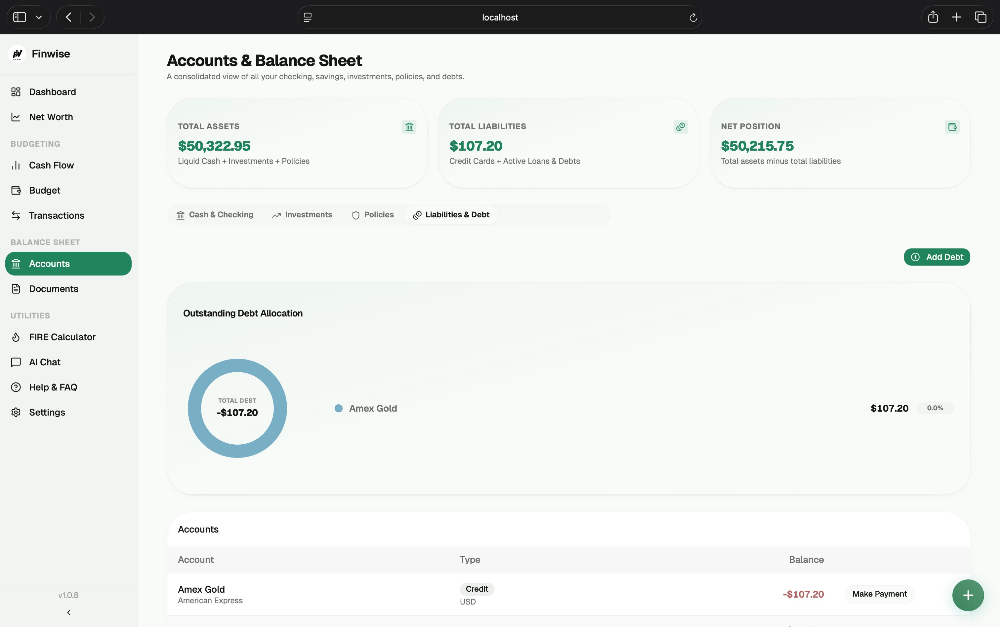

### 10. FIRE Financial Freedom Calculator
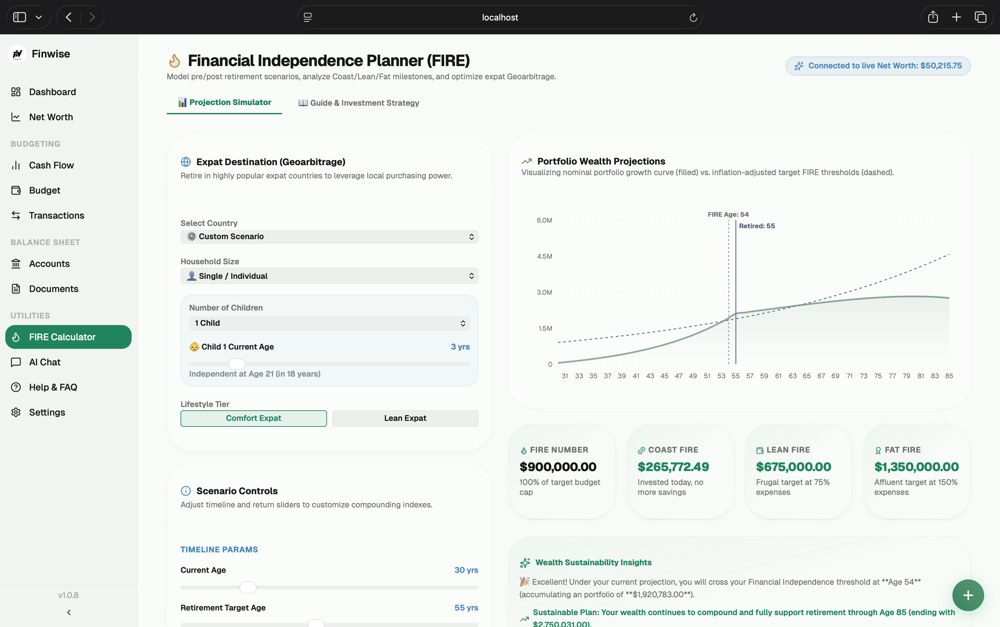

### 11. Local AI Financial Assistant
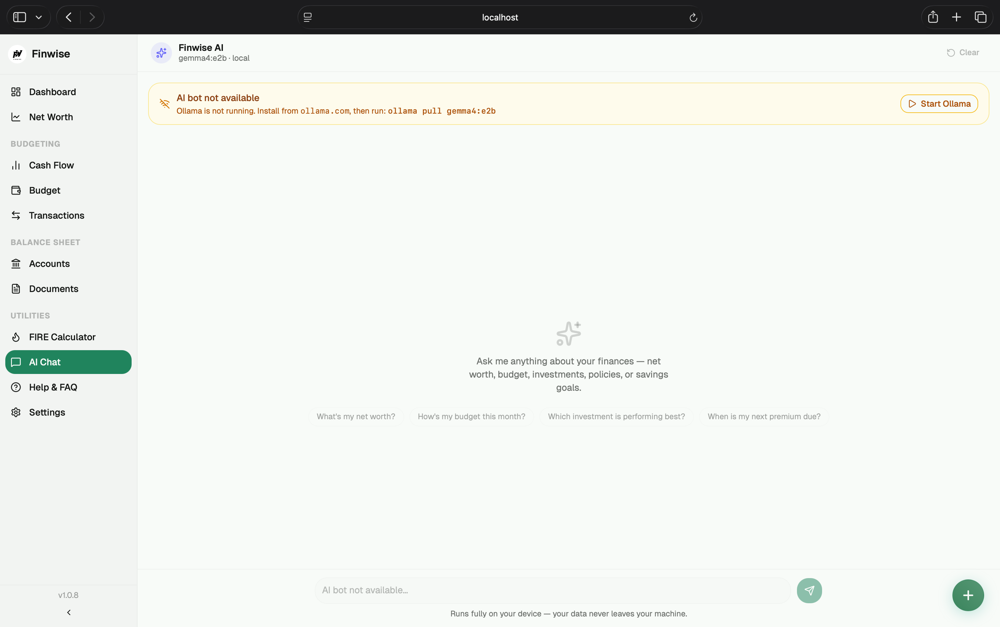

### 12. Help & Documentation
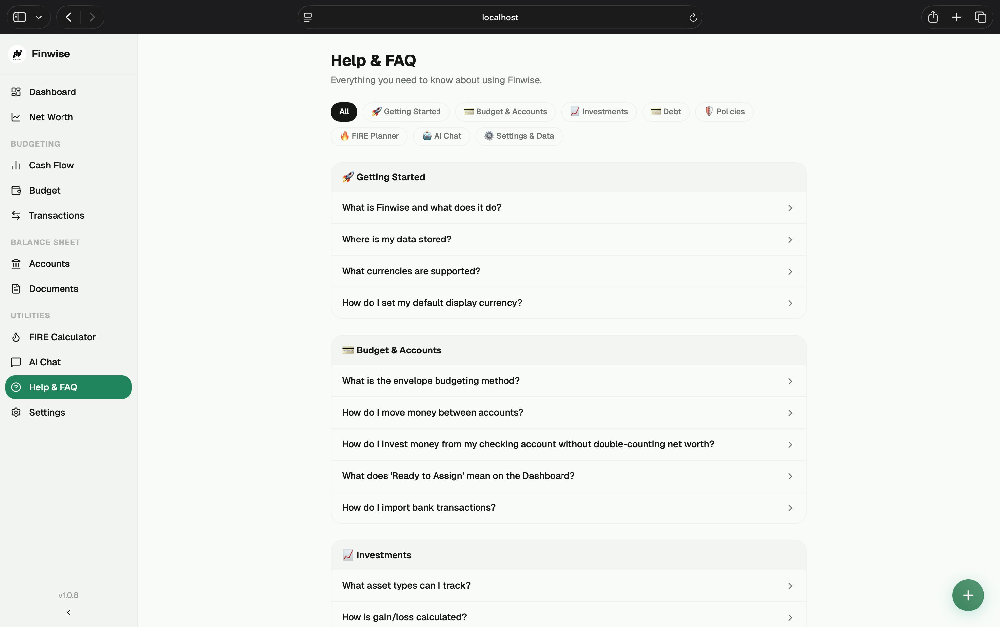

### 13. Settings & Backups
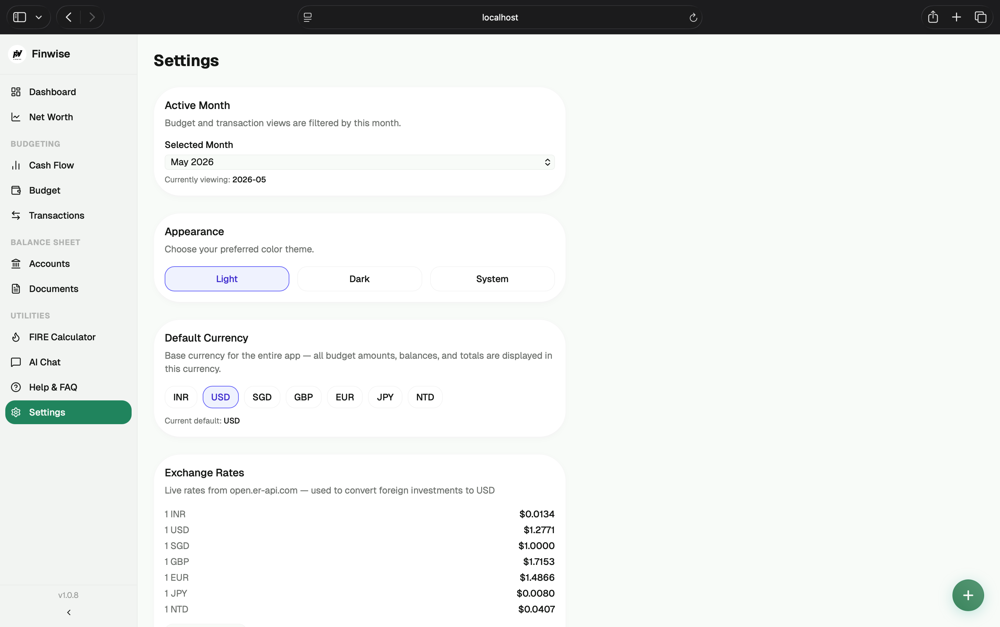

### 14. Secure Document Storage
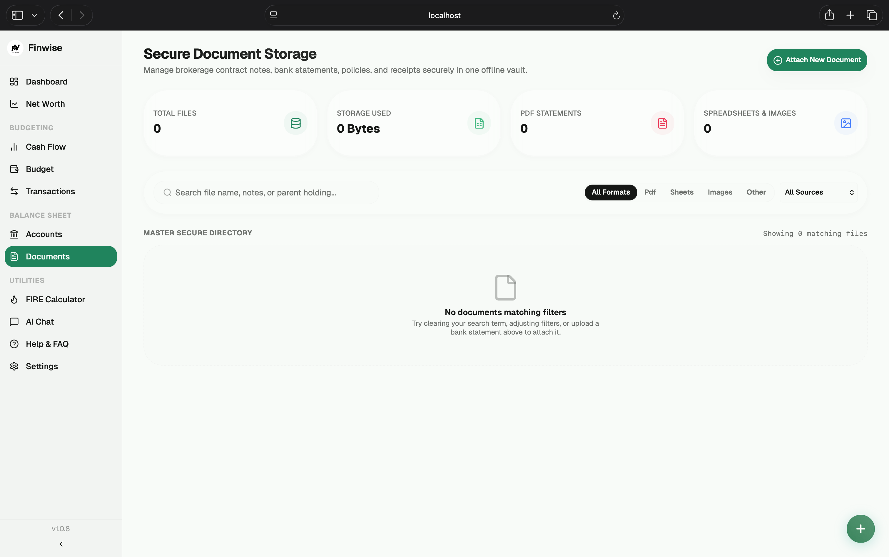

---

## Tech Stack

| Layer | Technology |
|-------|-----------|
| **Desktop Wrapper** | Tauri v2 + Rust |
| **Frontend** | React 19 + Vite + TypeScript + TailwindCSS 4 |
| **Backend** | Hono (Node.js / TypeScript) bundled as a Tauri Sidecar |
| **Database** | SQLite + SQLCipher (`better-sqlite3-multiple-ciphers`) |
| **ORM** | Drizzle ORM |
| **AI LLM Client** | Ollama (Local desktop instance) |

---

## Prerequisites for Modifying & Building

To customize or compile the codebase, make sure your build machine has:
- **Node.js 22+**
- **pnpm 10+**
- **Rust & Cargo** (for compiling Tauri wrappers). If you want to cross-compile a single **Universal DMG** (supporting both Intel and Apple Silicon), you should install Rust via [rustup](https://rustup.rs) and install both compile targets:
  ```bash
  rustup target add aarch64-apple-darwin
  rustup target add x86_64-apple-darwin
  ```
- **Ollama** (for AI chat features, running locally on your Mac):
  ```bash
  ollama pull gemma4:e4b
  ```

---

## Local Development

openFinance uses Turborepo to orchestrate development tasks. Install dependencies and start the development servers:

```bash
# 1. Install workspace dependencies
pnpm install

# 2. Spin up frontend (port 1420) and backend dev servers (port 3001)
pnpm dev
```

During development:
- The React client runs at `http://localhost:1420`.
- Tauri opens a development webview window mapped to the Vite hot-reloading server.
- The Node server starts in watch mode with tsx.

---

## Building the Standalone macOS DMG Installer

To package a standalone `.dmg` installer containing the zero-dependency Node sidecar and custom icons, execute the unified build script:

```bash
./scripts/build-dmg.sh
```

### What this script does:
1. **Syncs Versioning**: Reads the project's root version (e.g. `3.0.2`) and synchronizes it across all package configs and Tauri settings.
2. **Bundles Server Sidecar**: Compiles the backend into an ESM bundle with a CommonJS require bridge, and copies all binary native dependencies (like SQLCipher ciphers).
3. **Bundles Node Runtimes**: Copies the host Node binary and pulls the opposite architecture's Node binary directly from `nodejs.org`, preparing both sidecar slots.
4. **Compiles Tauri Client**:
   - If `rustup` is installed with both architectures, it automatically cross-compiles and creates a **Universal macOS DMG** (`openFinance_3.1.0_universal.dmg`).
   - If `rustup` is missing (Homebrew), it gracefully builds a native package for the host CPU architecture.

The compiled outputs will be available under:
`apps/desktop/src-tauri/target/universal-apple-darwin/release/bundle/dmg/` (Universal) or `target/release/bundle/dmg/` (Native).

### ⚠️ macOS Gatekeeper Warning ("Developer cannot be verified")

Because the compiled app is self-signed, macOS Gatekeeper will block it on first launch. 

**To open it:**
1. **Right-click** (or Control-click) **openFinance.app** in your **Applications** folder and select **Open**.
2. Click **Open** on the confirmation dialog. 
3. *Alternatively*, open your terminal and run:
   ```bash
   xattr -cr /Applications/openFinance.app
   ```

---

## Project Structure

```
openFinance/
├── apps/
│   ├── server/               # Hono backend API server (TypeScript)
│   │   ├── src/
│   │   │   ├── ai/           # Local Ollama client & chat memories
│   │   │   ├── db/           # Drizzle ORM schemas & SQLite connection
│   │   │   ├── routes/       # API router endpoints
│   │   │   └── services/     # Core logic (Budgets, Documents, crypto)
│   │   └── scripts/          # Server bundling and sidecar copier scripts
│   │
│   └── desktop/              # React frontend client & Tauri desktop wrapper
│       ├── src-tauri/        # Tauri Rust configurations, sidecar binaries, & app icons
│       └── src/              # React client source files (Vite, TailwindCSS)
│
├── packages/
│   └── shared/               # Monorepo shared contract & validator types
│
├── docs/                     # Architecture & system design documentation
├── screenshots/              # README previews
├── scripts/                  # DMG builder pipeline script
├── package.json              # Workspace root package config
└── pnpm-workspace.yaml       # Monorepo workspace configuration
```

---

## Changelog

See [CHANGELOG.md](./CHANGELOG.md) for full project releases and commit histories.
