# 🦉 openFinance (v4.1.0) — Your Money. Your Rules. 💸

A self-hosted personal finance powerhouse built for developers, privacy purists, and builders who want **absolute control** over their financial destiny. No cloud trackers, no data brokers sniffing your transaction history, and no subscription fees. Just gorgeous Obsidian dashboards and secure offline AI chat, running 100% on your own hardware.

openFinance ships as a native macOS app you install from a `.dmg` like anything else. The whole stack — React UI, Hono API server, and an encrypted SQLite database — lives inside the one app bundle. No Docker, no database server, no network. One script (`./scripts/build-mac.sh`) builds the installer. 🚀

---

## ⚡ Superpowers

- 🛡️ **Local-First & Passcode-Protected** — Runs entirely on your own Mac. The database is unlocked with a passcode you set on first launch, and your data never leaves the machine.
- 🔒 **Encrypted at Rest, End to End** — The entire database is SQLCipher-encrypted with your passcode, and uploaded bank statements, contract notes, and AI chat memories get their own AES-256-GCM layer on disk. Lose the passcode and the file is just noise.
- 📦 **One-File Install** — Drag one app into Applications. The UI, the API server, its Node runtime, and the database engine are all inside the bundle; nothing else to install and nothing to keep running.
- 💸 **Envelope Budgeting** — Dynamic zero-based budgeting with custom rollovers (carry it forward, cap it, or reset it).
- 🏦 **Unified Balance Sheet** — Scannable tracking across Checking, Savings, Credit Cards, Cash, Investments, and Loans.
- 📈 **Tax-Loss & Portfolio Tracking** — Real-time performance metrics across mutual funds, stocks, bonds, high-yield deposits, real estate, and crypto.
- 🧠 **100% Offline Local AI Chat** — Talk to your database! Ask natural-language questions like *"How much did I spend on Starbucks this month?"* powered by a local Ollama model. Your data never leaves your machine.
- 💱 **Global Multi-Currency Engine** — Native support for INR, USD, SGD, GBP, EUR, JPY, and NTD with dynamic exchange rates and localized formatting.
- 🌿 **Tactile Obsidian Theme** — A stunning, tactile user experience with rich layered depth, sage-green dark mode undertones, elegant brand gradients, and fluid transitions.
- 📦 **One-Click Backup & Import** — Decrypts files on export to a standard `.zip` folder and re-encrypts with your key when importing.

---

## Screenshots

### 1. Dashboard
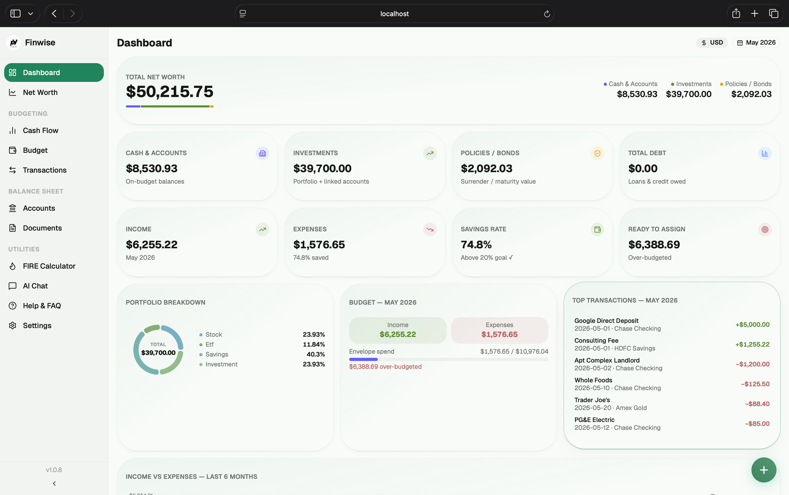

### 2. Net Worth Analytics
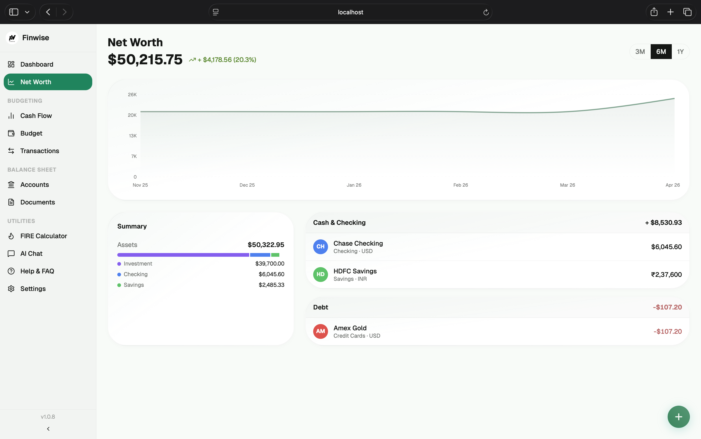

### 3. Cash Flow Visualizer
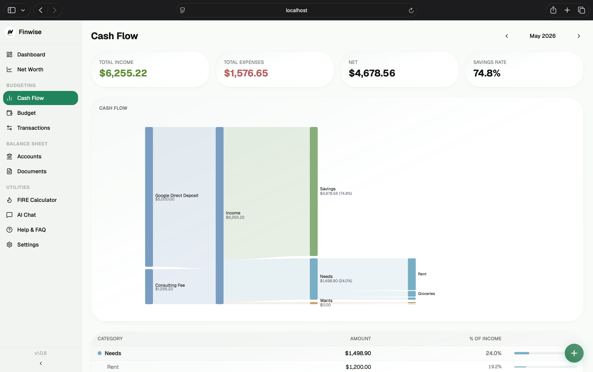

### 4. Envelope Budgeting
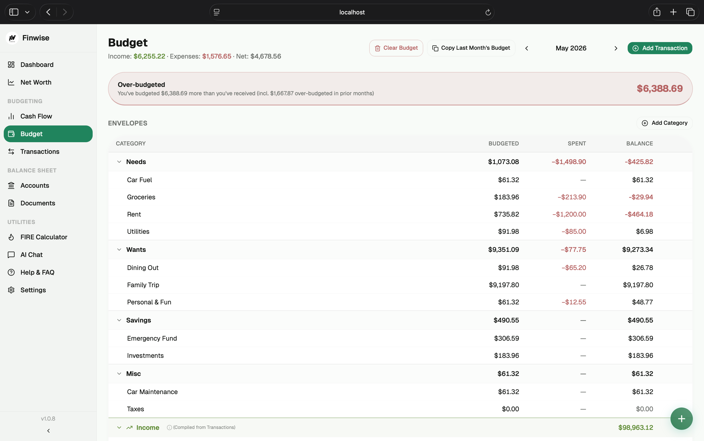

### 5. Transactions Ledger
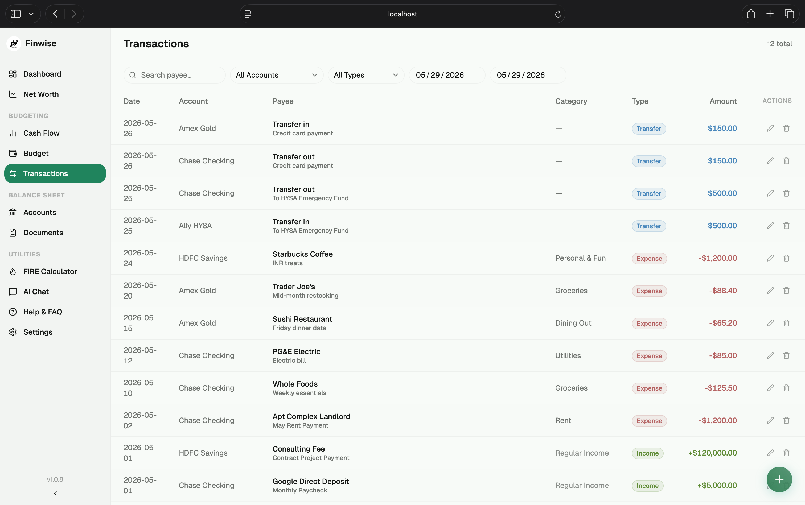

### 6. Checking & Savings Accounts
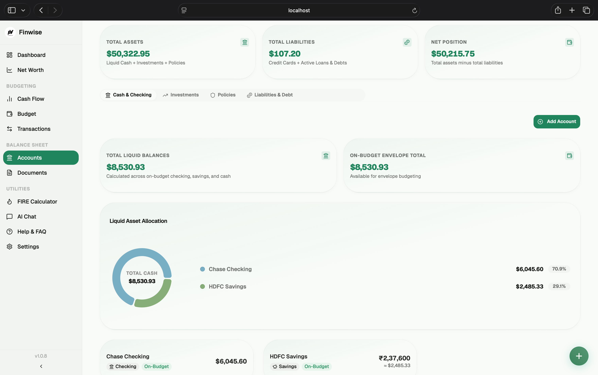

### 7. Investments & Holdings
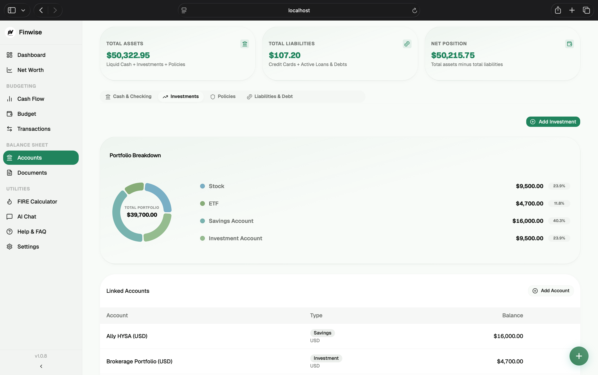

### 8. Insurance Policies
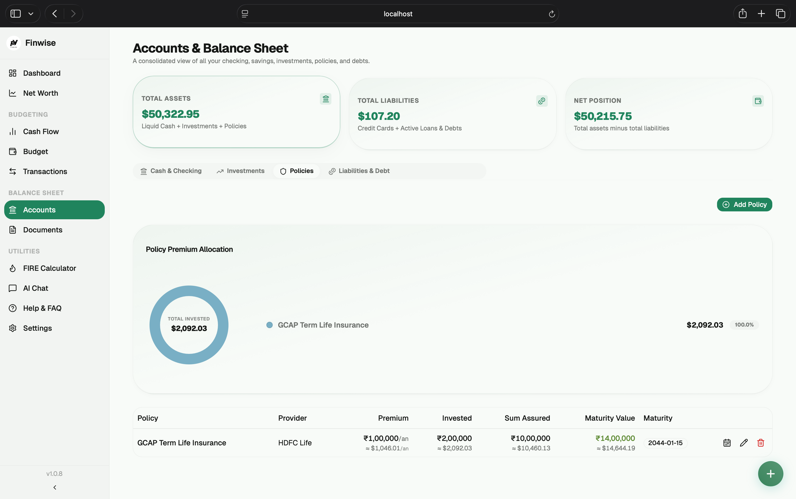

### 9. Debt & Loans Tracker
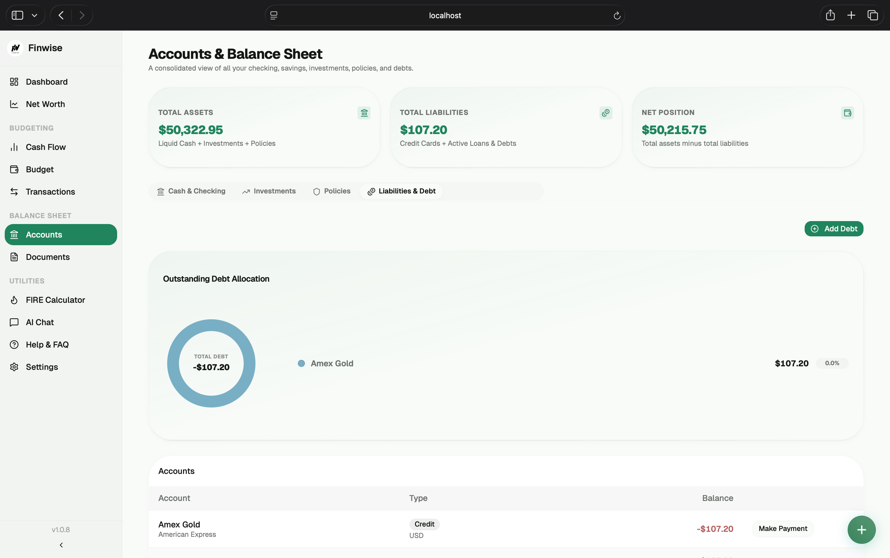

### 10. Local AI Financial Assistant
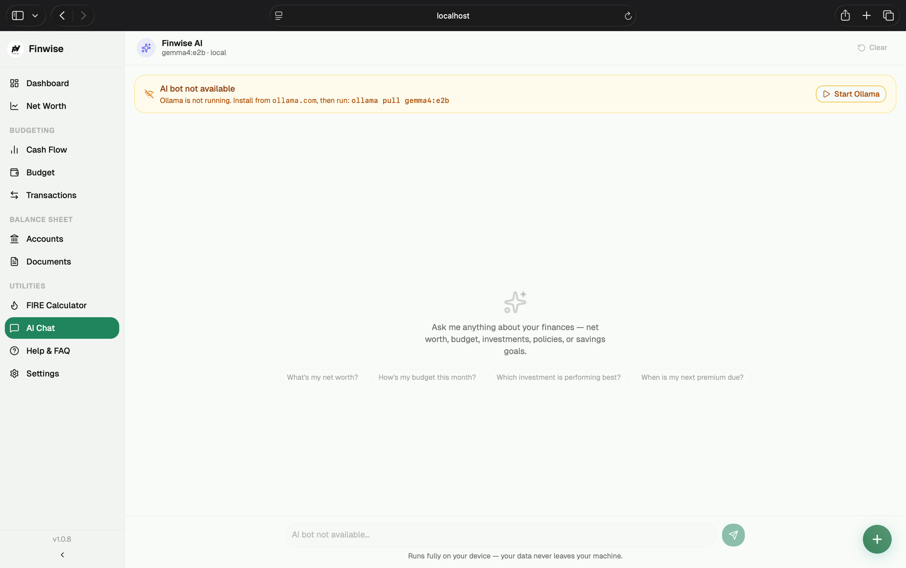

### 11. Help & Documentation
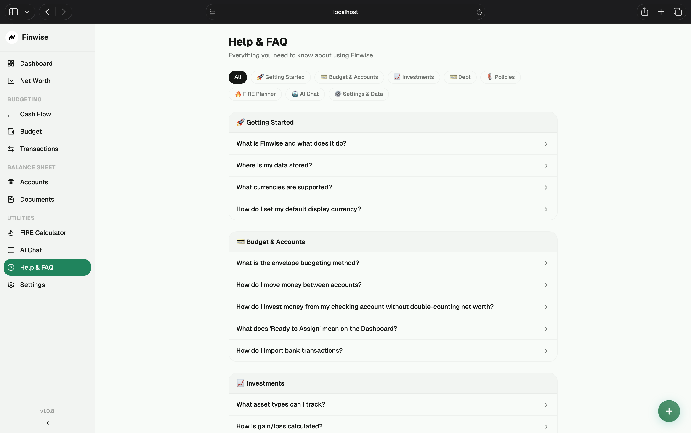

### 12. Settings & Backups
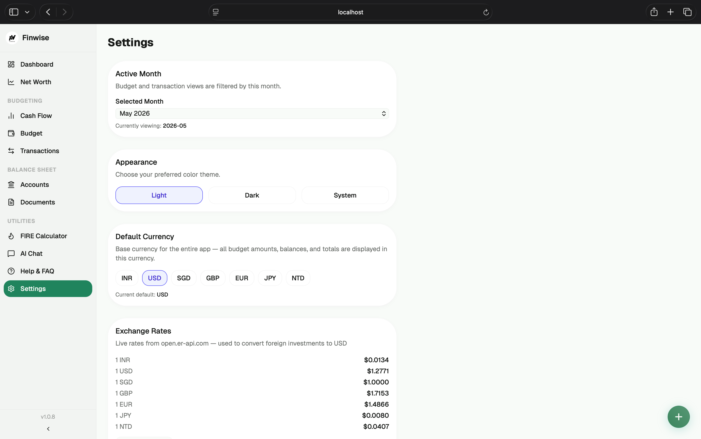

### 13. Secure Document Storage
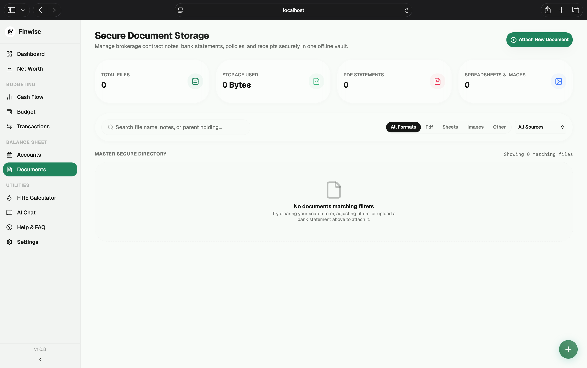

---

## Tech Stack

| Layer | Technology |
|-------|-----------|
| **Frontend** | React 19 + Vite + TypeScript + TailwindCSS 4 |
| **Backend** | Hono (Node.js / TypeScript) |
| **Database** | SQLite (SQLCipher-encrypted, via better-sqlite3-multiple-ciphers) |
| **ORM** | Drizzle ORM |
| **AI LLM Client** | Ollama (local instance) |
| **App Shell** | Tauri 2 (Rust + WebKit) |
| **Packaging** | macOS `.dmg` with a bundled Node sidecar |

---

## Prerequisites

To **run** the app:
- **macOS** — nothing else. The installer carries everything it needs.

To **build the installer** or **modify the codebase**:
- **macOS** with Xcode command line tools (`xcode-select --install`)
- **Rust** — install from [rustup.rs](https://rustup.rs)
- **Node.js 22+**
- **pnpm 10+**
- **Ollama** (optional, for AI chat features):
  ```bash
  ollama pull gemma4:e2b
  ```

---

## Building the Mac App

```bash
./scripts/build-mac.sh
```

That is the whole thing. The script installs dependencies, bundles the API server into a single JavaScript file, downloads the Node runtime that will run it inside the app, and hands the lot to Tauri to package. The finished installer lands in `apps/desktop/src-tauri/target/release/bundle/dmg/`.

Open the `.dmg` and drag **openFinance** into Applications.

The build is unsigned, so macOS Gatekeeper stops the first launch. Get past it once and it never asks again:

- right-click the app in Applications → **Open** → **Open**, or
- `xattr -cr /Applications/openFinance.app`

### First launch

You are asked to **set a passcode**. That passcode is the database encryption key — it is not stored anywhere, so there is no reset. Write it down somewhere safe. Every later launch asks for it to unlock.

If you ever need to start over, the unlock screen has a **Reset App / Wipe Database** link.

### Where your data lives

```
~/Library/Application Support/com.anindaghosh.openfinance/
├── openfinance.db      # SQLCipher-encrypted database
├── uploads/            # Documents, AES-256-GCM encrypted
└── chat-memories/      # AI conversation memories, encrypted
```

Time Machine picks this up like any other folder. For a portable copy, use **Settings → Backup & Restore → Export** — it writes a single encrypted `.ofb` file.

---

## Migrating From a Self-Hosted Instance

Earlier versions of openFinance ran as a Docker stack against PostgreSQL. Moving that data into the Mac app goes through the app's own backup format, so nothing is lost in translation.

1. **On the old instance**, open **Settings → Backup & Restore → Export**. You get `openfinance-backup-<date>.ofb`, encrypted with your login password.
2. **Do this before tearing the stack down** — the export needs the running server, and decrypting your uploaded documents needs the `ENCRYPTION_KEY` from that deployment's `.env`. Keep that `.env` until the migration is confirmed.
3. **In the Mac app**, go to **Settings → Backup & Restore**, choose the `.ofb` file, and import it.
4. The app notices the backup was made by a different install and asks for the **username and password** you used on the hosted instance. Enter those and the restore runs.

Everything transfers: accounts, envelopes and their budgets, transactions, investments, policies, recurring rules, exchange rates, AI conversations, and uploaded documents. The documents are re-encrypted under your new passcode on the way in.

> ⚠️ **Import replaces all existing data** in the Mac app. Do it before you start entering anything by hand.

---

## Local Development

openFinance uses Turborepo to orchestrate development tasks.

```bash
# 1. Install workspace dependencies
pnpm install

# 2. Run the app in development, with the Tauri shell and hot reload
pnpm --filter openfinance-desktop tauri dev
```

The Tauri window opens on the passcode screen and starts the API server itself, against a database in the app's data directory.

To work on the UI or API in a browser instead:

```bash
pnpm --filter openfinance-desktop dev:all
```

- The React client runs at `http://localhost:1420`.
- The Node server starts in watch mode with tsx on port `3001`, using `DB_PATH` and `OPENFINANCE_DB_KEY` from your environment (both optional — it falls back to an unencrypted `openfinance.db` in the working directory).

Run the server test suite with `pnpm --filter @openfinance/server test`.

### AI assistant (Ollama)

The AI chat connects to any reachable [Ollama](https://ollama.com) server — configure the URL and model from the in-app **Settings → AI Assistant** page (defaults to `http://localhost:11434`). Nothing is hardcoded: point it at your Mac, a GPU box on your LAN, or anywhere else.

---

## Project Structure

```
openFinance/
├── apps/
│   ├── server/               # Hono backend API server (TypeScript)
│   │   ├── src/
│   │   │   ├── ai/           # Local Ollama client & chat memories
│   │   │   ├── db/           # Drizzle schema, encrypted SQLite connection, bootstrap
│   │   │   ├── routes/       # API router endpoints
│   │   │   └── services/     # Core logic (Budgets, Documents, crypto)
│   │   └── scripts/          # Server esbuild bundler
│   │
│   └── desktop/              # React frontend client (Vite, TailwindCSS)
│       └── src-tauri/        # Rust app shell: passcode gate, server sidecar
│
├── packages/
│   └── shared/               # Monorepo shared contract & validator types
│
├── screenshots/              # README previews
├── scripts/
│   ├── build-mac.sh          # Builds the macOS app and .dmg installer
│   └── convert-backup.mjs    # Decrypts legacy Finwise backups
├── package.json              # Workspace root package config
└── pnpm-workspace.yaml       # Monorepo workspace configuration
```

---

## Changelog

See [CHANGELOG.md](./CHANGELOG.md) for full project releases and commit histories.
